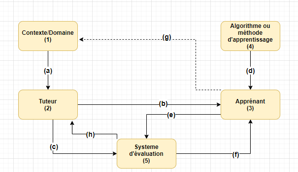
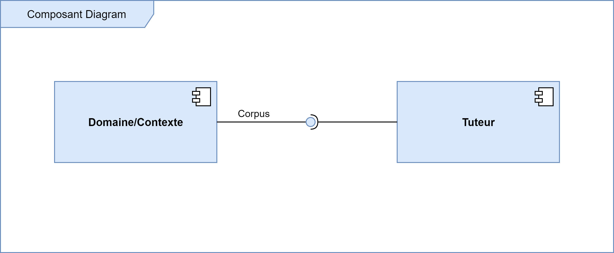
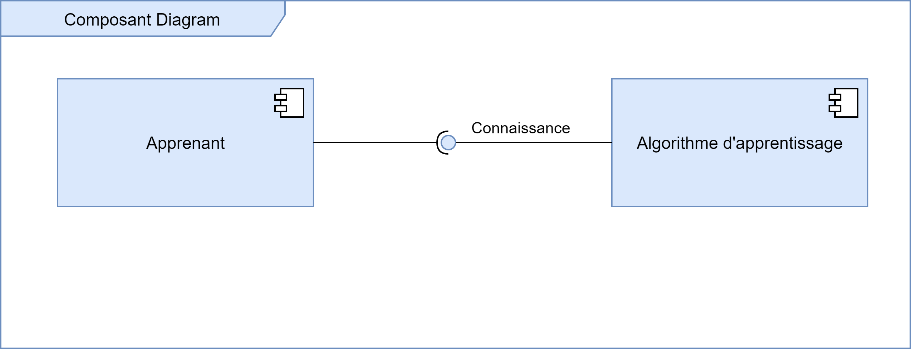
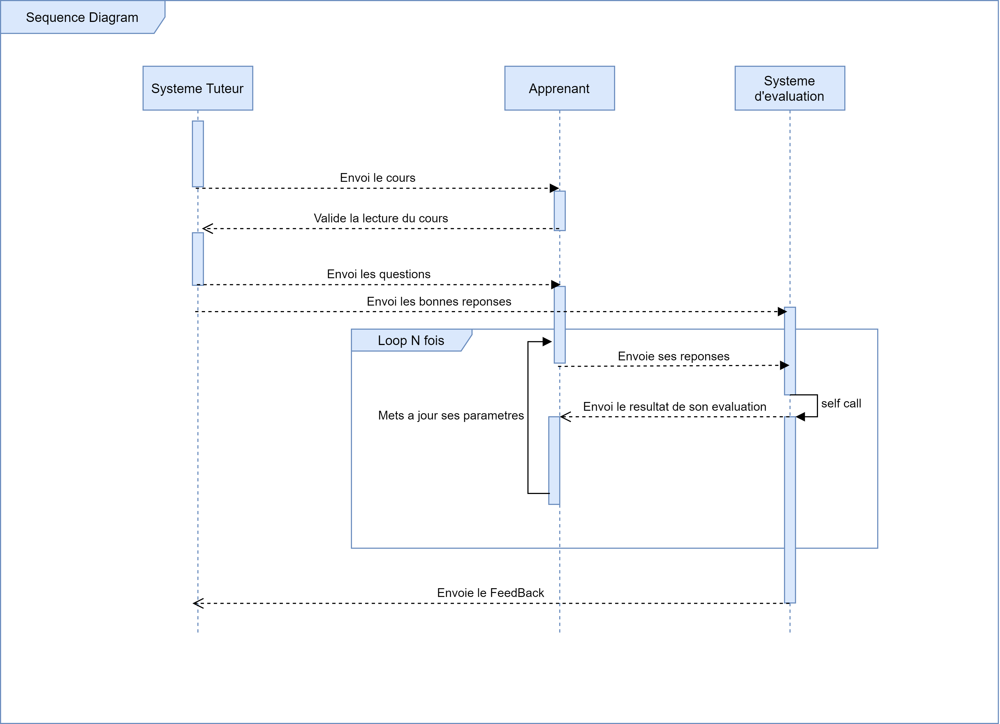

# Projet STI (Système Tutoriel Intelligent), [Ecole Nationale Superieure Polytechnique Yaounde](https://polytechnique.cm/), 5e année Génie informatique (Annee Academique 2020-2021)

# Titre
Mise en place d’un système d’estimation automatique du niveau de difficulte des évaluations proposées par un STI

# Membres du groupe
- TIKENG NOTSAWO Pascal Junior
- NANDA ASSOBJIO Brice Yvan
- SINGNING YONTA Eddy
- KOUETCHOU Jordan
- MENGONG Simon
- NDOUMBE Marina

# Superviseur :
Dr. BATCHAKUI BERNABE

# Résumé
Selon l'article ["Analyse de qualité d’un MOOC : le point de vue des étudiants"](https://www.erudit.org/fr/revues/ritpu/2016-v13-n2-3-ritpu02997/1039250ar/), les premiers modèles de formation à distance (FAD) s’inscrivaient dans un courant pédagogique béhavioriste/cognitiviste, centrant leur attention sur l’individu en tant qu’entité autonome et apprenant seul. À l’origine, le rôle de l’étudiant se limitait à un rôle plutôt passif consistant à consulter les ressources mises à sa disposition, à réaliser les exercices et à remettre les travaux. Ce modèle a largement évolué, notamment en raison de l’évolution des technologies rendues disponibles et des courants pédagogiques qui ont changé à travers le temps. En FAD, on retrouve maintenant une grande diversité de modèles pédagogiques dans lesquels on retrouve différents procédés pour favoriser la présence sociale des participants, la présence de l’enseignant, les interactions, etc. Récemment, une nouvelle formule a vu le jour et s’est ajoutée à l’offre de service de la FAD des établissements postsecondaires : les cours en ligne ouverts aux masses (MOOC). Ce type de formation à distance est offert gratuitement, ne nécessite aucun préalable (d’où le terme « ouvert ») et attire des milliers, et parfois même des centaines de milliers d’apprenants(d’où le terme « masse »). Toutefois, derrière cette évolution plutôt spectaculaire des FAD se cache une subtilité d’une grande importance : la qualité des évaluations. En effet, parmi les apprenants, plusieurs n’ont aucune expérience préalable en FAD et on constate également un taux d’abandon très élevé (de 90 à 95 % selon Christensen et al.,2013 et 95 % selon Breslow et al., 2013) en raison de la qualité des enseignements et des évaluations proposées. Nous proposons ainsi dans le présent projet un système permettant d'adapter les évaluations aux enseignements proposés par les tuteurs. L'évaluation de notre méthode sur les questions à choix multiples (QCMs, plus précisément les opérations arithmétiques) et les études de compréhension de texte (ECT) nous a permis de détecter deux scénarios majeures pouvant affecter l'apprentissage dans une plateforme de FAD : la surévaluation et la sous-évaluation des apprenants. Comme valeur ajoutée, nous améliorons les algorithmes d'apprentissage par renforcement existants afin de permettre à nos agents de comprendre le langage naturel, et nous proposons une approche d'évaluation automatique basées sur les réseaux de neurones artificiels. 

# Présentation de la solution

Description globale du système. Les chiffres représentent les modules du système et les
lettres les interactions entre ces modules. Le tuteur (2) propose le cours et des questions (b) à
l’apprenant (3) dans un contexte donné (1), et fournit (c) les réponses au système d’évaluation (5).
L’apprenant (3) apprend (d) d’abord le contenu du cours grâce à un algorithme d’apprentissage (4)
et propose (e) ensuite des réponses aux questions récues (b) du tuteur (2) au système d’évaluation
(5). Le système d’évaluation retourne (f) ensuite une note à l’apprenant (3) ainsi que des indications
si nécessaire. Les cycles (d)-(e)-(f) se répètent pendant un certain nombre d’étapes (que nous appellerons époques d’apprentissage/évaluation) fixées à l’avance. Après cela le système d’évaluation
retourne (h) feedback (note de l’apprenant, comportement de l’apprenant) au tuteur pour qu’il
puisse ajuster les évaluations par rapport au présent cours en conséquence.

Diagramme de composant contexte-tuteur, où l’interface fournie (corpus) vient du
Domaine/Contexte, et l’interface requise vient du tuteur.

Diagramme de composant algorithme d’apprentissage-apprenant, permettant l’acquisition (interface acquise) des connaissances par l’apprenant.

Diagramme de séquence entre le tuteur, l’apprenant et le système d’évaluation.

# Matériels Supplementaires : 
- Rapport complet : https://drive.google.com/file/d/1wQQ7_RWGwNUvR-ps5OaLF_8xXUMU-uRc/view?usp=sharing
- Experimentations : voir le dossier [notebooks](notebooks)